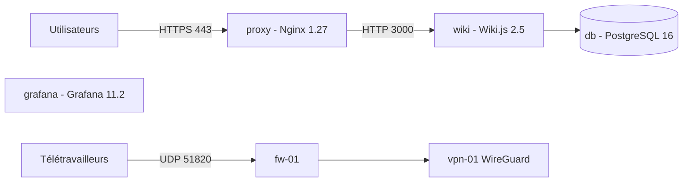

# Plateforme d'hébergement – équipe Infra

## Description

Dépôt de configuration de la plateforme d'hébergement de l'équipe Infra. Il décrit, sous forme de fichiers versionnés, les services conteneurisés (reverse proxy Nginx, wiki, Grafana, PostgreSQL) déployés avec Docker Compose sur les hôtes `srv-01` et `srv-02`, ainsi que les scripts et commandes pour les vérifier et les déployer.

## Architecture



| Machine | Rôle | Adresse |
| --- | --- | --- |
| `srv-01` | Hôte Docker : services web, reverse proxy Nginx | 10.0.10.11 |
| `srv-02` | Hôte Docker : supervision, bases de données | 10.0.10.12 |
| `fw-01` | Pare-feu périmétrique | 10.0.0.1 |
| `vpn-01` | Serveur WireGuard (UDP 51820) | 10.0.0.20 |

| Service | Image | Exposition |
| --- | --- | --- |
| `proxy` | `nginx:1.27-alpine` | ports 80 et 443 de l'hôte, seul point d'entrée |
| `wiki` | `requarks/wiki:2.5` | réseau Docker interne, via le proxy (`wiki.tdw.local`) |
| `grafana` | `grafana/grafana:11.2.0` | réseau Docker interne |
| `db` | `postgres:16-alpine` | réseau Docker interne uniquement, données dans le volume `db-data` |

- Les virtual hosts Nginx sont dans `nginx/conf.d/`, les certificats TLS dans `/etc/letsencrypt` sur l'hôte.
- Détail de l'inventaire : [`docs/infra.md`](docs/infra.md). Décisions d'architecture : [`docs/adr/`](docs/adr/).
- *Hypothèse* : la répartition exacte des services entre `srv-01` et `srv-02` n'est pas décrite dans le dépôt ; le même `docker-compose.yml` est déployé sur chaque hôte.

## Prérequis

- Docker Engine avec le plugin Docker Compose v2 (`docker compose`) – *hypothèse : Docker 27 ou plus récent, la version n'est pas fixée dans le dépôt*
- `make`, `rsync`, `ssh`
- `shellcheck` et `yamllint` pour les vérifications (`make lint`)
- Un accès SSH par clé avec l'utilisateur `deploy` sur `srv-01` / `srv-02` (jamais en root)

## Installation et déploiement

```bash
# 1. Récupérer le dépôt
git clone https://github.com/IKadri-droid/eval-collab-kadri.git
cd eval-collab-kadri

# 2. Créer le fichier de secrets local (ignoré par Git) et remplacer les valeurs « changeme »
cp .env.example .env

# 3. Vérifier la configuration
make lint
make check

# 4. Déployer sur un hôte
make deploy HOST=srv-01
```

`scripts/deploy.sh` copie le dépôt (sans `.git` ni `.env`) dans `/opt/stack` sur l'hôte avec `rsync`, puis lance `docker compose pull` et `docker compose up -d`, et affiche l'état avec `docker compose ps`.

Variables d'environnement (fichier `.env`, voir `.env.example`) :

| Variable | Utilisée par | Rôle |
| --- | --- | --- |
| `WIKI_DB_PASSWORD` | `wiki`, `db` | Mot de passe PostgreSQL du wiki |
| `GRAFANA_ADMIN_PASSWORD` | `grafana` | Mot de passe administrateur Grafana |

## Vérifications

| Commande | Ce qu'elle vérifie |
| --- | --- |
| `make lint` | `shellcheck` sur `scripts/*.sh` et `yamllint` sur `docker-compose.yml` et `.github/` |
| `make check` | `docker compose config -q` (syntaxe compose) et `nginx -t` dans un conteneur (configuration Nginx) |

Après un déploiement : `ssh deploy@srv-01 "cd /opt/stack && docker compose ps"` doit montrer tous les services `running`.

## Exploitation (journaux, redémarrage)

Sur l'hôte, dans `/opt/stack` :

```bash
docker compose ps                    # état des services
docker compose logs -f --tail=100 proxy   # journaux d'un service
docker compose restart wiki          # redémarrer un service
docker compose exec proxy nginx -t && docker compose exec proxy nginx -s reload   # recharger Nginx
```

- **Ne jamais utiliser `docker compose down -v`** : l'option `-v` supprime le volume `db-data` et donc la base du wiki.
- Certificats TLS : renouvelés à la main avec certbot tous les 90 jours (voir `docs/infra.md`), puis rechargement de Nginx. Ce point est traité par l'[ADR-0001](docs/adr/0001-choix-reverse-proxy.md).

## Contribuer

- Workflow GitHub Flow : `main` est protégée, toute modification passe par une Pull Request.
- Branches : `<type>/<n° issue>-<description>` (ex. `docs/2-documentation`, `fix/12-vpn-firewall`).
- Commits au format [Conventional Commits](https://www.conventionalcommits.org/) : `type(scope): description`.
- Reviews au format [Conventional Comments](https://conventionalcomments.org/) ; les relecteurs sont désignés par `.github/CODEOWNERS`.
- Utiliser les modèles d'issue (Bug / incident, Évolution / documentation) et de PR ; lier l'issue avec `Closes #N`.
- `make lint` et `make check` doivent passer avant d'ouvrir la PR. Aucun secret dans le dépôt.
- Les consignes pour les agents IA sont dans [`AGENTS.md`](AGENTS.md).

## Contacts

- Mainteneur du dépôt : @IKadri-droid (propriétaire via `CODEOWNERS`)
- Questions et incidents : ouvrir une issue ; en urgence, canal `#infra-astreinte`
